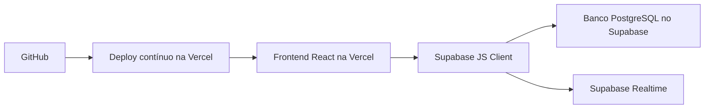
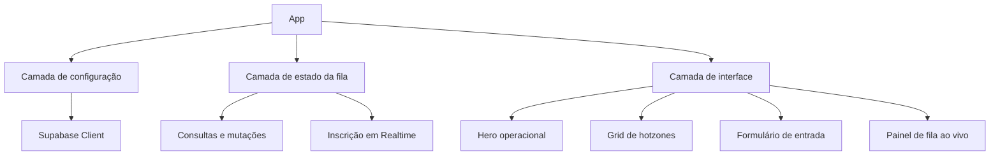
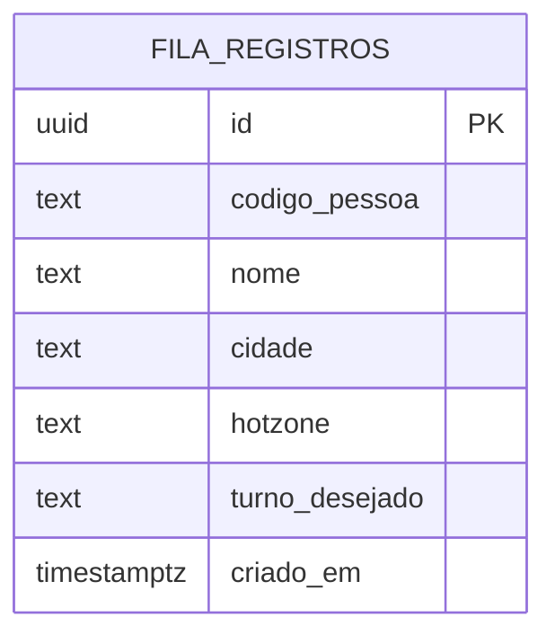

## 1. Desenho de Arquitetura



## 2. Descrição de Tecnologias
- Frontend: React 18 + TypeScript + Vite
- Estilização: Tailwind CSS 3 com variáveis CSS para tema visual operacional
- Componentes auxiliares: Lucide React para ícones e biblioteca leve de utilitários para formatação de data
- Backend: sem servidor dedicado na primeira versão; consumo direto do Supabase pelo frontend
- Banco de dados: PostgreSQL no Supabase
- Tempo real: Supabase Realtime inscrito na tabela principal da fila
- Hospedagem: Vercel com deploy conectado ao GitHub
- Versionamento: Git local sincronizado com `https://github.com/ACSTECN/FILAS-ALX.git`

## 3. Definição de Rotas
| Rota | Objetivo |
|-------|---------|
| / | Página principal com seleção de hotzones, formulário de entrada e painel da fila ao vivo |

## 4. Definições de API
Como a primeira versão usará Supabase diretamente no frontend, o acesso será feito via client SDK com tipagem local.

```ts
type Cidade = "Rio de Janeiro" | "São Paulo";

type Hotzone =
  | "Bangu"
  | "Santa Cruz"
  | "Tijuca"
  | "Nilópolis"
  | "Zona Sul"
  | "Mooca"
  | "Paulista"
  | "Santo Amaro";

type TurnoDesejado = "Manhã" | "Tarde" | "Noite" | "Madrugada" | "Flexível";

type FilaRegistro = {
  id: string;
  codigo_pessoa: string;
  nome: string;
  cidade: Cidade;
  hotzone: Hotzone;
  turno_desejado: TurnoDesejado;
  criado_em: string;
};
```

### Operações previstas
- `insert` em `fila_registros`: adiciona um novo participante na fila
- `select` em `fila_registros`: lista todos os participantes ativos ordenados por `criado_em`
- `delete` em `fila_registros`: retira um participante da fila
- `realtime` em `fila_registros`: sincroniza entradas e saídas em todos os clientes conectados

## 5. Diagrama da Estrutura de Cliente



## 6. Modelo de Dados
### 6.1 Definição do Modelo



### 6.2 Linguagem de Definição de Dados

```sql
create extension if not exists pgcrypto;

create table if not exists public.fila_registros (
    id uuid primary key default gen_random_uuid(),
    codigo_pessoa text not null,
    nome text not null,
    cidade text not null check (cidade in ('Rio de Janeiro', 'São Paulo')),
    hotzone text not null check (
        hotzone in (
            'Bangu',
            'Santa Cruz',
            'Tijuca',
            'Nilópolis',
            'Zona Sul',
            'Mooca',
            'Paulista',
            'Santo Amaro'
        )
    ),
    turno_desejado text not null check (
        turno_desejado in ('Manhã', 'Tarde', 'Noite', 'Madrugada', 'Flexível')
    ),
    criado_em timestamptz not null default now()
);

create index if not exists fila_registros_criado_em_idx
    on public.fila_registros (criado_em asc);

create index if not exists fila_registros_cidade_hotzone_idx
    on public.fila_registros (cidade, hotzone);

alter publication supabase_realtime add table public.fila_registros;
```

## 7. Decisões Técnicas da Primeira Versão
- A aplicação será uma SPA com foco em rapidez operacional.
- O cadastro será público para reduzir atrito de entrada.
- A remoção da fila também ficará disponível na interface inicial, conforme requisito do projeto.
- Como existe risco operacional em permitir remoção pública, a arquitetura deixará espaço para futura proteção por PIN ou perfil administrativo sem reescrever a base do sistema.
- As credenciais do Supabase serão expostas apenas via variáveis públicas de frontend compatíveis com Vite e Vercel.
