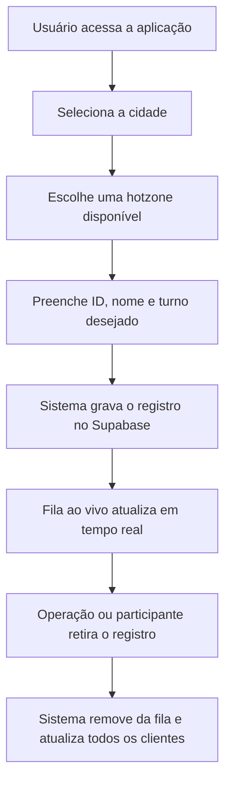

## 1. Visão Geral do Produto
ALX Entregas será uma aplicação web de fila operacional por hotzone para organizar a entrada de entregadores ou interessados em turnos desejados nas regiões do Rio de Janeiro e São Paulo.
- O produto resolve o controle manual de filas, deixando o cadastro e a visualização em tempo real simples, pública e centralizada.
- O valor principal é acelerar a gestão de espera por região, reduzir confusão no atendimento e dar transparência para todos que estiverem na fila.

## 2. Funcionalidades Principais

### 2.1 Perfis de Uso
| Perfil | Forma de acesso | Permissões principais |
|------|------------------|-----------------------|
| Participante da fila | Acesso direto pelo navegador | Entrar na fila, escolher hotzone, escolher turno desejado, visualizar todas as filas e retirar seu registro da lista |
| Operação local | Acesso direto pelo navegador | Visualizar a fila completa em tempo real e retirar registros conforme atendimento |

### 2.2 Módulos Essenciais
1. **Página principal**: apresentação da operação ALX Entregas, seletor de cidade, grade de hotzones, formulário de entrada e painel ao vivo.
2. **Fila ao vivo**: listagem completa dos registros ativos, filtros por cidade e hotzone, ordenação por chegada e ação de retirada.

### 2.3 Detalhamento da Página
| Nome da página | Nome do módulo | Descrição da funcionalidade |
|-----------|-------------|---------------------|
| Página principal | Hero operacional | Explica o propósito do sistema, destaca cidades atendidas e direciona para o cadastro rápido |
| Página principal | Seletor de cidade | Alterna entre Rio de Janeiro e São Paulo para atualizar as hotzones exibidas |
| Página principal | Grade de hotzones | Exibe quadrados clicáveis com as regiões disponíveis: Bangu, Santa Cruz, Tijuca, Nilópolis, Zona Sul, Mooca, Paulista e Santo Amaro |
| Página principal | Formulário de entrada | Recebe ID, nome, hotzone e turno desejado para inserir o participante na fila |
| Página principal | Resumo operacional | Mostra quantidade total na fila, quantidade por cidade e destaque da hotzone mais movimentada |
| Fila ao vivo | Lista em tempo real | Mostra todos os registros ativos com ordem de entrada, nome, ID, cidade, hotzone, turno e horário |
| Fila ao vivo | Filtros rápidos | Permite filtrar por cidade, hotzone e turno desejado |
| Fila ao vivo | Retirada da fila | Remove um registro da fila em tempo real para todos os usuários conectados |

## 3. Processo Principal
O participante acessa o site, escolhe a cidade, toca na hotzone desejada, informa seu ID, nome e turno pretendido, e entra na fila. Logo após o envio, o cadastro aparece para todos no painel ao vivo. Quando a pessoa for atendida ou desistir, o registro pode ser retirado da lista e essa remoção também aparece em tempo real para todos os conectados.

## 4. Design de Interface
### 4.1 Estilo Visual
- Cores principais: azul petróleo, grafite profundo e branco gelo, com acentos em laranja sinalizador para chamadas operacionais.
- Estilo dos botões: blocos sólidos com cantos largos, relevo suave e estados de hover luminosos.
- Tipografia: fonte de display industrial para títulos e fonte limpa de alta legibilidade para dados da operação.
- Layout: desktop-first com painel editorial, blocos grandes de hotzone e tabela viva lateral.
- Ícones: SVG lineares com linguagem logística e sinalização urbana.

### 4.2 Visão de Design por Módulo
| Nome da página | Nome do módulo | Elementos de UI |
|-----------|-------------|-------------|
| Página principal | Hero operacional | Fundo com camadas de gradiente escuro, mapa abstrato, títulos fortes e indicador de operação ao vivo |
| Página principal | Grade de hotzones | Cards quadrados robustos, cores por cidade, destaque de seleção e contador por região |
| Página principal | Formulário de entrada | Campos amplos, labels claros, feedback visual instantâneo e CTA dominante |
| Página principal | Resumo operacional | KPIs em cards com números grandes e atualização dinâmica |
| Fila ao vivo | Lista em tempo real | Tabela ou cards híbridos com marcação de posição, horário e botões de retirada |
| Fila ao vivo | Filtros rápidos | Chips e selects com navegação rápida entre cidades, hotzones e turnos |

### 4.3 Responsividade
O projeto será desktop-first, com adaptação para tablet e mobile. Em telas menores, a grade de hotzones vira duas colunas, o formulário sobe para o topo e a fila ao vivo passa a usar cards empilhados com ações táteis.
